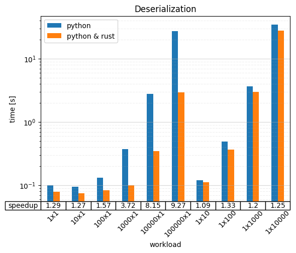

# Simple Benchmark for the Rust Extensions of the Neo4j Python Driver
This repository contains a simple benchmark for the Rust extensions of the Neo4j Python driver.
The benchmark compares the performance of running different workloads through the Python driver with and with having the Rust extensions installed.


## Workloads
The workloads are chose to test:
 * Read-heavy work (called *deserialization*)
 * Write-heavy work (called *serialization*)

Further, each workload is parameterized along two dimensions:
 * Width (how large a single unit of data is)
 * Length (how many units of data there are)

In particular, this means:
 * Deserialization of `NxM`: The query produces `M` records with 1 column containing a list of `N` pieces of data.  
   In this case, the data was chosen to be the string `"qwertyuiopasdfghjklzxcvbnmQWERTYUIOPASDFGHJKLZXCVBNMM"`.
 * Serialization of `NxM`: The query is submitted with a parameter that's an `N` long list of lists with `M` elements each.  
   In this case, the elements were chosen to be the string `"qwertyuiopasdfghjklzxcvbnmQWERTYUIOPASDFGHJKLZXCVBNMM"`.

Each workload is repeated multiple times simply summing up the time take to get more stable results.


## Results
Here are the results of running the benchmark on my machine (Lenovo p1 Gen. 3, Intel i9–10885H, 64 GB DDR4 RAM@3200 MHz):




For a discussion of the results, see the blog post at [https://medium.com/neo4j/neo4j-python-driver-10x-faster-with-rust-7059c56e8674](https://medium.com/neo4j/neo4j-python-driver-10x-faster-with-rust-7059c56e8674).


## Run It Yourself
 * Get docker
 * Get Python (3.12) (including `pip` and `venv`/`virtualenv`)  
   `run.sh` assumes that the Python executable is called `python3.12`, if it's not, you may simply adjust the script
 * Start Neo4j in docker:
   ```bash
   docker run --rm -p 7687:7687 --name=neo4j-rust-ext-bench \
     -e NEO4J_AUTH=neo4j/pass \
     -e NEO4J_dbms_security_auth__minimum__password__length=1 \
     neo4j:5.23
   ```
 * Get bash (or do the steps in `run.sh` manually, skipping the next step)
 * Run `./run.sh`
 * Find the results in ...


## Developing
Before committing, please run
```bash
pip install -Ur requirements.txt
ruff format && ruff check --fix && mypy --strict --ignore-missing-imports .
```
